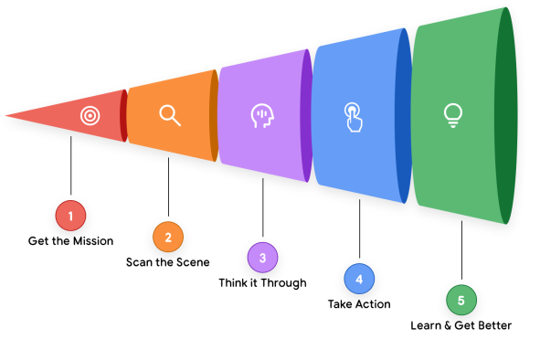

> 以下內容，並非個人創作，而是個人的摘要重點與整理，部分範例與翻譯解釋為個人思考的結果，請斟酌參考。  
> 參考資料於頁尾。

## AI Agents

AI Agent 具有 4 要素：

1. `The Model`（大腦）：用來處理資訊與推理、評估、決策。模型的類型（通用、微調或多模態）決定了智能體的認知能力
2. `Tools`（手）：此機制將 agent 與外部系統連接起來，讓 agent 能夠執行除了文字生成之外的其他操作。包括 API 調用、資料庫查詢、文件操作等。Agent System 可以規劃語言模型要使用的工具、執行，並將結果放到下次呼叫的上下文中
3. `The Orchestration Layer`（神經系統）：控制進程，用來管理 Agent 的運作循環，如：規劃、記憶（狀態）和推理策略執行。在此會使用提示框架和推理技術（如：Chain-of-Thought4 或 ReAct5）將目標分解成若干步驟。同時賦予記憶功能。
4. `Deployment`（身體與肢體）：生產部署是確保可靠、易於存取的關鍵。託管代理並用於監控、日誌紀錄和管理是必要的整合。用戶可透過圖形介面存取代理程序。其他 Agent 也可以透過 Agent-to-Agent (A2A) API 調用。

語言模型具有極高的靈活性，但也帶來最大的課題。以往我們稱 Prompt Engineering 但現在稱作或轉型為 Context Engineering，因為現在我們需要輸入指令、事實、可呼叫工具、歷史記錄等等，將配置內容都填入上下文視窗管理，獲取輸出，而非簡單的文字生成。

## Agent 的問題解決流程

> “LMs in a loop with tools to accomplish an objective.”

AI Agent 的循環很複雜，但大致上有以下幾個過程：

1. 獲取任務：一個具有明確、高層次的目標，比如
   以使用者的輸入來說：請幫我計畫下一次會議與參與人員
   以內部自觸發器來說：收到一份新的郵件
2. 掃描場景：Agent 會判斷調度層存取了什麼可用資源
3. 仔細思考：這是核心思考循環，是由模型驅動。它會藉由前兩步「獲取任務」以及「掃描場景」制定計畫，這會思考背後所需資訊，比如開會，AI 需要使用 get_members tool 獲取人員，並使用 Google Calendar API tool 獲取可開會時間。
4. 採取行動：調度層
5. 觀察與迭代：

簡而言之，「思考、行動、觀察」這樣的流程由 Orchestration Layer 管理，由 Model 推理，藉由 Tools 執行，直到完成任務。

123

## Ref.

- https://www.kaggle.com/learn-guide/5-day-agents
